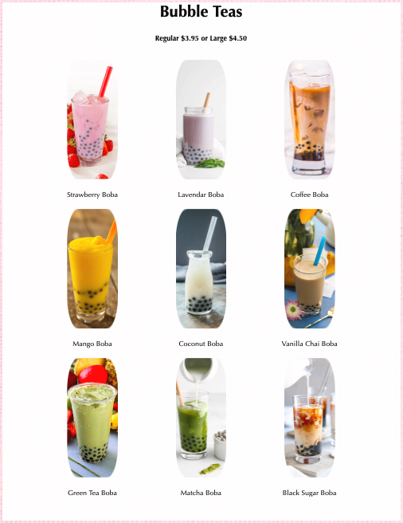
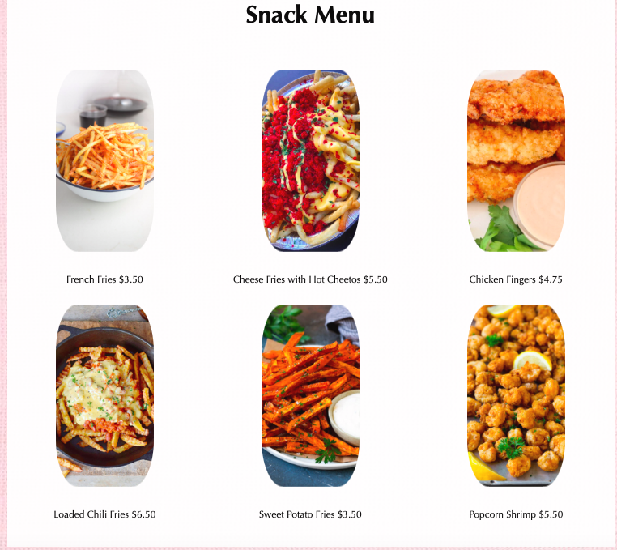
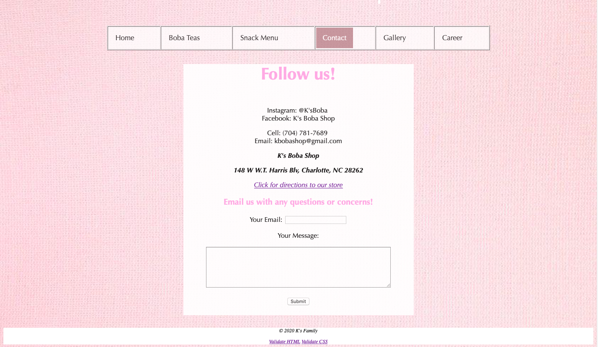
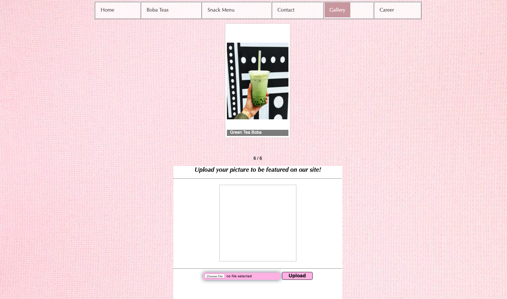
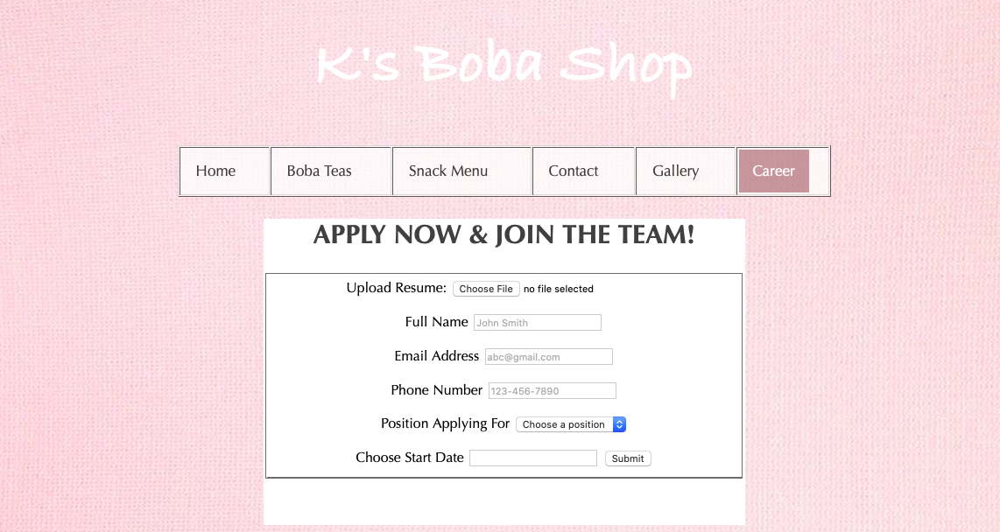

# BobaShop
The purpose of this project was to design and develop a website for a real client. My client is a young entrepreneur who is planning to open up her own boba shop in the near future. I wanted this website to have interactivity for the customers to overall enhance the user exeprience. The images below are screenshots of the site; the menus shows pictures of each item. The contact, gallery, and career page are all interactive where users able to send messages, post pictures, and even apply for a job. 

